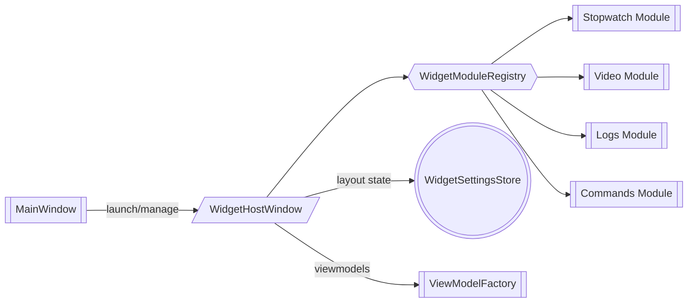

# План эволюции окна секундомера в полноценный виджет-хост

## 1. Цель

Создать расширяемое «окно виджетов», которое заменит текущий [`StopwatchWindow`](src/views/stopwatch_window.py) и позволит подключать несколько независимых панелей (секундомер, видеоплеер, логи, кастомные команды) с поддержкой вынесения на дополнительный монитор, режима "поверх всех окон" и гибкого отображения.

## 2. Функциональные требования

| Категория | Требование |
|-----------|------------|
| Виджеты | Добавление/удаление карточек (секундомер, видеоплеер, консольные логи, быстрые команды). |
| Макет | Перетаскивание и сохранение позиции/размера карточек, пресеты раскладок. |
| Окно | Выбор монитора при открытии, авто-запоминание последнего экрана, опция Always-on-Top, прозрачное перетаскивание. |
| Команды | Встроенная панель «доп. команд» (горячие клавиши, отправка предустановленных скриптов). |
| Расширения | API для регистрации модулей через конфиг (`widget_modules.yaml`) и фабрику ViewModel. |
| Статус | Интеграция с [`MainWindow`](src/views/main_window.py) для синхронизации состояния и меню запуска. |

## 3. Архитектурный подход

### Компоненты

| Компонент | Роль |
|-----------|------|
| `WidgetHostWindow` | Наследник `QtWidgets.QWidget`, который управляет контейнером карточек, меню, выборами монитора. Заменит текущий `StopwatchWindow`. |
| `WidgetCanvas` | Виртуальный рабочий стол с grid/flex layout и поддержкой drag-and-drop ячеек. |
| `WidgetModuleRegistry` | Реестр модулей: описывает типы виджетов, их ViewModel и настройки. |
| `ModuleDockItem` | Обёртка над конкретным модулем (секундомер, видео и т.д.) с рамкой, заголовком, кнопками управления. |
| `WidgetHostViewModel` | Синхронизация состояния (какие модули активны, где расположены, какие команды доступны). |
| `WidgetSettingsStore` | Сериализует раскладки, монитор и флаги «поверх всех» в [`config/config.ini`](config/config.ini) или отдельный JSON. |

### Потоки данных

## 4. План работ (итерации)

1. **Анализ и подготовка**
   - Провести аудит текущего [`StopwatchWindow`](src/views/stopwatch_window.py) и его связей с [`StopwatchViewModel`](src/viewmodels/stopwatch_viewmodel.py).
   - Определить минимальный набор модулей первого релиза: секундомер (готовый), панель логов (reuse [`ConsolePanelView`](src/views/console_panel_view.py)), панель команд.

2. **Инфраструктура виджет-хоста**
   - Создать `WidgetHostWindow` и `WidgetCanvas` в `src/views/widget_host_window.py`.
   - Добавить `WidgetHostViewModel` и `WidgetModuleRegistry` в `src/viewmodels/widget_host_viewmodel.py`.
   - Реализовать Always-on-Top (`Qt.WindowStaysOnTopHint`), переключение монитор/геометрии, сохранение состояния в `WidgetSettingsStore`.

3. **Система модулей**
   - Описать DSL конфигурации (`config/widget_modules.yaml`) с типом модуля, ViewModel и начальными параметрами.
   - Подготовить адаптеры для секундомера, логов и доп. команд (каждый модуль — класс вида `StopwatchHostModule`).
   - Обеспечить поддержку горячего добавления (через меню «+» в окне) и удаления.

4. **UI и UX**
   - Ввести панель управления (иконки «Док/Раздок», «Поверх всех», «Выбрать экран», «Сброс раскладки»).
   - Добавить вспомогательный toolbar для запуска предустановленных команд (подключение к `MainWindow._send_command`).
   - Опционально реализовать акрил/матовый фон, чтобы окно выглядело как «виджет-доска».

5. **Интеграция и автоматизация**
   - Обновить меню View и tray действия в [`MainWindow`](src/views/main_window.py) для открытия нового окна.
   - Добавить smoke-тест `tests/test_widget_host_window.py` (проверка загрузки конфигурации, Always-on-Top флага).
   - Расширить [`docs/architecture.md`](docs/architecture.md) описанием новой подсистемы.

6. **Расширение модулей**
   - **Видео-плеер**: внедрить PySide6 Multimedia, предусмотреть управление громкостью и списком источников.
   - **Консольные логи**: embed режим [`ConsolePanelView`](src/views/console_panel_view.py) или облегчённый reader из `logs/`.
   - **Доп. команды**: грид кнопок, отправляющих команды через [`MainViewModel`](src/viewmodels/main_viewmodel.py).

## 5. UX-сценарии

1. Пользователь открывает окно через меню View → «Панель виджетов». Предлагается список мониторов, окно позиционируется на выбранном.
2. Через кнопку «+» добавляет модули: секундомер (по умолчанию), логи, команды.
3. Перетаскивает карточки, закрепляет Always-on-Top и разворачивает окно на дополнительном экране.
4. Команды отправляются прямо из карточки, результаты моментально отражаются в основном приложении.

## 6. Тестирование

- Юнит-тесты на `WidgetModuleRegistry` (корректная регистрация, загрузка конфигурации).
- Интеграционные pytest-qt тесты на `WidgetHostWindow`: загрузка модулей, переключение Always-on-Top, сериализация положения.
- Snapshot проверки QSS для карточек.

## 7. Риски и меры

| Риск | Митигирующая мера |
|------|--------------------|
| Сложность drag-and-drop | Использовать существующие Qt Layouts с минимальными кастомизациями, предусмотреть fallback в виде фиксированной сетки. |
| Утечка памяти при выгрузке модулей | Каждая карточка подписывается на `destroyed`, ViewModel обрабатывает `cleanup`. |
| Конфликт горячих клавиш | Все хоткеи хоста регистрируются в отдельной группе и проверяются на пересечения с [`MainWindow`](src/views/main_window.py). |
| Второй монитор недоступен | Реализовать graceful fallback (центрирование на основном экране). |

## 8. Открытые вопросы

- Нужно ли поддерживать «режим сцен» (несколько сохранённых раскладок)?
- Требуется ли API для внешних плагинов (загрузка Python-модулей из `plugins/`)?
- Допускать ли виджеты без ViewModel (например, iframe / webview) — требует анализа безопасности.

## 9. План консолидации/удаления старого окна секундомера

1. **Инвентаризация**
   - Задокументировать все места, где вызывается [`StopwatchWindow`](src/views/stopwatch_window.py) (меню View, tray, горячие клавиши).
   - Оценить зависимости в тестах и документации.

2. **Временный адаптер**
   - Создать обёртку `LegacyStopwatchModule`, которая использует существующий UI, но размещается внутри нового `WidgetHostWindow`. Это позволит мигрировать без кода-дубликата.

3. **Обновление ссылок**
   - Перенаправить действия меню/трее на `WidgetHostWindow` с предзагруженным модулем «Секундомер».
   - Обновить документацию (README, docs/stopwatch_plan.md) и подсказки в UI.

4. **Удаление ненужного кода**
   - После стабилизации нового окна полностью удалить `StopwatchWindow`, его импорт в `MainWindow`, отдельные экшены и тесты — приложение не должно содержать отдельного окна секундомера вовсе.
   - Очистить QSS/ресурсы/документацию, где упоминалось legacy окно (README, screenshots).

5. **Регрессия и релиз**
   - Прогнать smoke-тесты, убедиться, что горячие клавиши и статус-бар работают прежним образом.
   - Отметить завершение миграции в `docs/widget_host_plan.md` и релизных заметках.

