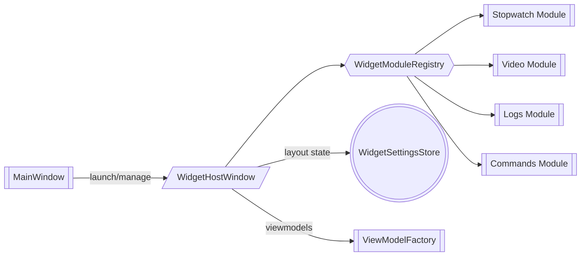

# План эволюции окна секундомера в полноценный виджет-хост

## 1. Цель

Создать расширяемое «окно виджетов», которое заменит текущий [`StopwatchWindow`](src/views/stopwatch_window.py) и позволит подключать несколько независимых панелей (секундомер, видеоплеер, логи, кастомные команды) с поддержкой вынесения на дополнительный монитор, режима "поверх всех окон" и гибкого отображения.

## 2. Функциональные требования

| Категория | Требование |
|-----------|------------|
| Виджеты | Добавление/удаление карточек (секундомер, видеоплеер, консольные логи, быстрые команды). |
| Макет | Перетаскивание и сохранение позиции/размера карточек, пресеты раскладок. |
| Окно | Выбор монитора при открытии, авто-запоминание последнего экрана, опция Always-on-Top, прозрачное перетаскивание. |
| Команды | Встроенная панель «доп. команд» (горячие клавиши, отправка предустановленных скриптов). |
| Расширения | API для регистрации модулей через конфиг (`widget_modules.yaml`) и фабрику ViewModel. |
| Статус | Интеграция с [`MainWindow`](src/views/main_window.py) для синхронизации состояния и меню запуска. |

## 3. Архитектурный подход

### Компоненты

| Компонент | Роль |
|-----------|------|
| `WidgetHostWindow` | Наследник `QtWidgets.QWidget`, который управляет контейнером карточек, меню, выборами монитора. Заменит текущий `StopwatchWindow`. |
| `WidgetCanvas` | Виртуальный рабочий стол с grid/flex layout и поддержкой drag-and-drop ячеек. |
| `WidgetModuleRegistry` | Реестр модулей: описывает типы виджетов, их ViewModel и настройки. |
| `ModuleDockItem` | Обёртка над конкретным модулем (секундомер, видео и т.д.) с рамкой, заголовком, кнопками управления. |
| `WidgetHostViewModel` | Синхронизация состояния (какие модули активны, где расположены, какие команды доступны). |
| `WidgetSettingsStore` | Сериализует раскладки, монитор и флаги «поверх всех» в [`config/config.ini`](config/config.ini) или отдельный JSON. |

### Потоки данных



## 4. План работ (итерации)

1. **Анализ и подготовка**  *(07.03.2026)*
   - Провести аудит текущего [`StopwatchWindow`](src/views/stopwatch_window.py) и его связей с [`StopwatchViewModel`](src/viewmodels/stopwatch_viewmodel.py).
   - Определить минимальный набор модулей первого релиза: секундомер (готовый), панель логов (reuse [`ConsolePanelView`](src/views/console_panel_view.py)), панель команд.

   **Результаты аудита**

   - [`StopwatchWindow`](src/views/stopwatch_window.py:13) является лёгким обёрточным `QtWidgets.QWidget`, создающим карточку с готовым [`StopwatchWidget`](src/views/widgets/stopwatch_widget.py:12) и закреплённым [`StopwatchViewModel`](src/viewmodels/stopwatch_viewmodel.py:13); окно открывается в режиме `Qt.Tool`, перехватывает `closeEvent`, чтобы всегда скрываться вместо уничтожения, и обновляет заголовок при смене языка через `translator`.
   - [`MainWindow._toggle_stopwatch_window`](src/views/main_window.py:904) лениво импортирует окно и управляет его жизненным циклом; дополнительно виджет секундомера всегда присутствует в правой панели [`MainWindow`](src/views/main_window.py:790), что требует при замене предусмотреть единую фабрику `WidgetHostViewModel`, чтобы не раздувать отдельные экземпляры `StopwatchViewModel`.
   - Меню View, пункт «Открыть секундомер» и shortcut `Ctrl+Shift+T` (создаются в [`MainWindow._setup_menu`](src/views/main_window.py:1134) и [`MainWindow._setup_shortcuts`](src/views/main_window.py:1200)) напрямую вызывают `_toggle_stopwatch_window`; тест [`tests/test_structure.py`](tests/test_structure.py:39) подтверждает обязательность экспортов `StopwatchWindow` и `StopwatchWidget`.

   **Минимальный набор модулей релиза и переиспользование**

   1. **Секундомер** — перенос текущего [`StopwatchWidget`](src/views/widgets/stopwatch_widget.py:12) и [`StopwatchViewModel`](src/viewmodels/stopwatch_viewmodel.py:13) в новый `WidgetHostModule`. Требуется предусмотреть adapter для состояния окна (Always-on-Top, монитор) через хост.
   2. **Панель логов** — встраивание существующего [`ConsolePanelView`](src/views/console_panel_view.py:1) как самостоятельной карточки, используя передаваемую конфигурацию (лимиты, темы) и общий `LogExportWorker`. Для экономии памяти `WidgetHostWindow` должен инициировать `append_rx/append_tx` через общие сигналы, чтобы не дублировать логи.
   3. **Панель команд** — облегчённая сетка быстрых команд поверх текущей логики `_send_command`/`QuickBlocksPanel` внутри [`MainWindow`](src/views/main_window.py:915); модуль хоста должен подписываться на публичные методы `MainWindow` или `MainViewModel`, чтобы переиспользовать существующие `quick_blocks`/`history` механизмы без дублирования UI.

   Такое разделение подтверждает готовность перехода к шагу 2, так как зависимости и точки интеграции описаны, а реюз существующих компонентов понятен.

2. **Инфраструктура виджет-хоста**  *(07.03.2026)*
   - Создать `WidgetHostWindow` и `WidgetCanvas` в `src/views/widget_host_window.py`.
   - Добавить `WidgetHostViewModel` и `WidgetModuleRegistry` в `src/viewmodels/widget_host_viewmodel.py`.
   - Реализовать Always-on-Top (`Qt.WindowStaysOnTopHint`), переключение монитор/геометрии, сохранение состояния в `WidgetSettingsStore`.
   - ✅ *07.03.2026, Roo:* реализованы `WidgetModuleRegistry`, `ModuleDockItem` и `WidgetHostViewModel` ([`src/viewmodels/widget_host_viewmodel.py`](src/viewmodels/widget_host_viewmodel.py)), зарегистрированы в `service_container`.
   - ✅ *07.03.2026, Roo:* создан `WidgetSettingsStore` ([`src/utils/widget_settings_store.py`](src/utils/widget_settings_store.py)) с сериализацией геометрии, монитора и layout snapshot (`config/widget_layout.json`).

   **Архитектура и ответственность классов**

   - [`WidgetHostWindow`](src/views/widget_host_window.py) — наследник `QtWidgets.QWidget` (создаётся через `Qt.Tool` аналогично [`StopwatchWindow`](src/views/stopwatch_window.py:13)), инкапсулирует заголовок, системные кнопки (Always-on-Top toggle, выпадающий список дисплеев, кнопка «Док/Раздок»), а также обёртку над [`WidgetCanvas`](src/views/widget_host_window.py#WidgetCanvas). Главное поведение:
     - При первом `show()` запрашивает доступные `QtGui.QScreen` через `QtGui.QGuiApplication.screens()`, отображает выбранный пользователем монитор и безопасно центрируется, если target недоступен.
     - Тогглит флаг `Qt.WindowStaysOnTopHint`, сохраняя состояние в `WidgetSettingsStore.toggle_on_top(bool)`.
     - Делегирует загрузку карточек `WidgetHostViewModel.load_initial_layout()`, создавая для каждого `ModuleDockItem` контейнер-карточку (рамка, заголовок, кнопки «закрепить», «закрыть», «развернуть»). Карточки управляются через события `dockItemRequested`, `dockItemClosed`.
     - Поддерживает drag-and-drop через API `WidgetCanvas.moveDock(dock_id, target_cell)` и ресайз сеточных ячеек, применяя ограничения из [`Sizes`](src/styles/constants.py:130) (минимальная ширина, отступы карточек).

   - `WidgetCanvas` — составной `QtWidgets.QWidget`, внутри которого работает гибрид `QGridLayout` + overlay слоёв для визуальной подсветки. Основные элементы:
     - Модель ячеек (`CanvasCellModel`), содержащая `cell_id`, `row`, `col`, `row_span`, `col_span`.
     - Hover-слой (полупрозрачная рамка) и слой привязки, который подсвечивает валидные позиции при перетаскивании.
     - API `attachDock(dock: ModuleDockItem, layout_hint: LayoutPreset)` и событие `layoutChanged(LayoutSnapshot)`, чтобы `WidgetHostViewModel` мог сохранить состояние. Для жестов используется `QDrag` + mime payload `application/widget-dock`.
     - Fallback-режим: если drag-and-drop отключён платформой, включается фиксированная сетка (`Sizes.WIDGET_CANVAS_FIXED_GRID`, по умолчанию 2×2) и простые кнопки «вверх/вниз/влево/вправо» внутри карточки для перестановки.

   **Слой ViewModel и реестр модулей**

   - [`WidgetHostViewModel`](src/viewmodels/widget_host_viewmodel.py) — `QtCore.QObject`, агрегирующий список активных модулей и синхронизирующийся с [`WidgetSettingsStore`](#widgetsettingsstore) и [`WidgetModuleRegistry`](src/viewmodels/widget_host_viewmodel.py#WidgetModuleRegistry). Основные обязанности:
     - `modules_changed` сигнализирует `WidgetHostWindow` о необходимости пересоздать карточки.
     - Метод `ensure_module(module_id: str)` лениво запрашивает blueprint из реестра, создаёт View через фабрику (`registry.create_view(module_id, parent=WidgetCanvas)`), а ViewModel — через общий [`ViewModelFactory`](src/viewmodels/factory.py:19) или кастомный фабричный метод, зарегистрированный модулем.
     - Управляет командами контекстного меню («Удалить карточку», «Дублировать», «Закрепить layout») и координирует обновление статуса toolbar (например, доступность кнопки Always-on-Top берётся из текущего состояния окна).
     - Предоставляет API интеграции с [`MainWindow`](src/views/main_window.py:904): `WidgetHostViewModel.open_or_raise(host_parent)` позволяет `MainWindow` открыть окно с предзагруженным пресетом (например, только секундомер).

   - `WidgetModuleRegistry` — служба регистрации адаптеров модулей, собираемая при bootstrap приложения (в `run.py` после `service_container`). Интерфейс:
     - `register(module: WidgetModuleDescriptor)` — добавляет описание (id, display_name, icon, factory методов `create_view(parent)` и `create_viewmodel(service_container)`).
     - `list_available()` — отдаёт список модулей для кнопки «+» в `WidgetHostWindow`.
     - `create_dock(module_id)` — возвращает `ModuleDockItem` с уже созданным View и ViewModel, а также метаданные (минимальная ширина, поддержка hot reload).
     - Реестр хранится в `src/viewmodels/widget_host_viewmodel.py`, но регистрацию можно расширить через YAML (`config/widget_modules.yaml`), чтобы не пересобирать проект. Для модулей полагаемся на текущие View: `StopwatchHostModule` реюзит [`StopwatchWidget`](src/views/widgets/stopwatch_widget.py:12), `LogsHostModule` — [`ConsolePanelView`](src/views/console_panel_view.py:1), `QuickCommandsModule` — существующие `QuickBlocksPanel`/`QuickBlocksRepository`.

   **WidgetSettingsStore**

   - Представляет отдельный класс (`src/utils/widget_settings_store.py`), который оборачивает `configparser` и хранит настройки в секции `[widget_host]` файла [`config/config.ini`](config/config.ini). Данные:
     - `geometry` — hex сериализованный `QByteArray` от `saveGeometry()`.
     - `screen_name` — `QtGui.QScreen.name()` для восстановления монитора.
     - `always_on_top` — `bool`.
     - `layout_snapshot` — JSON (прописан в отдельном файле `widget_layout.json` или в ini) со списком карточек `{module_id, dock_id, cell: (row, col, row_span, col_span), pinned}`.
   - Методы: `load()` → `WidgetHostState`, `save(state: WidgetHostState)`; короткие хелперы `last_geometry()`, `last_screen()`, `toggle_on_top(value: bool)`.
   - Делегаты хранилища регистрируются через [`service_container`](src/utils/service_container.py:9), чтобы `WidgetHostViewModel` и `WidgetHostWindow` могли получать общий экземпляр.

   **Always-on-Top и выбор монитора**

   - Toggle «Поверх всех» реализуется как изменение `windowFlags` с пересозданием окна: `self.setWindowFlag(Qt.WindowStaysOnTopHint, enabled); self.show()` внутри `WidgetHostWindow._apply_on_top()`. Флаг сохраняется в `WidgetSettingsStore`.
   - Комбобокс «Монитор» заполняется именами `QScreen`. При выборе хост:
     1. Сохраняет выбранный `screen_name` в стор.
     2. Вызывает `_move_to_screen(screen: QScreen)` — вычисляет `screen.availableGeometry()` и размещает окно по последним сохранённым координатам, либо центрирует.
   - При старте, если нужный монитор отсутствует (например, отключён), выполняем fallback: окно позиционируется по `QGuiApplication.primaryScreen()` и в стор записывается новое имя (во избежание вечного показа офлайн-экрана).

   **Интеграция и тестирование**

   - `WidgetHostWindow` импортируется лениво из [`MainWindow`](src/views/main_window.py:904) так же, как `StopwatchWindow`, но вместо приватного `_stopwatch_window` создаётся `_widget_host_window`. Главное окно подписывается на `WidgetHostViewModel.modules_changed`, чтобы обновлять статус-бар (например, отображать активные карточки).
   - Тестовая стратегия: `tests/test_widget_host_window.py` покрывает
     1. Восстановление Always-on-Top флага из `WidgetSettingsStore`.
     2. Корректную загрузку layout-снапшота (проверяется список `ModuleDockItem` и их позиции).
     3. Реакцию на смену монитора (в тестах мокаем `QGuiApplication.screens`).
   - Smoke-путь: `WidgetHostWindow` будет использовать существующие службы (`translator`, `theme_manager`, `QuickBlocksRepository`) и не должен держать собственные копии сервисов — всё берётся из `service_container`. Это позволит встроить окно в текущий bootstrap (`src/run.py`) без дублирования зависимостей.

3. **Система модулей**  *(07.03.2026)*
   - Описать DSL конфигурации (`config/widget_modules.yaml`) с типом модуля, ViewModel и начальными параметрами.
   - Подготовить адаптеры для секундомера, логов и доп. команд (каждый модуль — класс вида `StopwatchHostModule`).
   - Обеспечить поддержку горячего добавления (через меню «+» в окне) и удаления.
   - ✅ *07.03.2026, Roo:* добавлена начальная инфраструктура WidgetModuleRegistry/WidgetHostViewModel + WidgetSettingsStore.

   **DSL `widget_modules.yaml`**

   - Структура файла:
     ```yaml
     configuration_version: 1
     modules:
       - id: stopwatch
         title: "Секундомер"
         icon: stopwatch
         category: telemetry
         view_class: src.views.widgets.stopwatch_widget.StopwatchWidget
         viewmodel_factory: stopwatch
         layout_hint:
           min_cells: 1
           preferred_size: { rows: 1, cols: 1 }
         inputs:
           requires_service: stopwatch_service
         hotkeys:
           toggle: Ctrl+Shift+T
         preset:
           start_hidden: false
           args: {}
     ```
   - Поля `view_class` и `viewmodel_factory` используются `WidgetModuleRegistry` для динамического импорта и получения экземпляра ViewModel через [`ViewModelFactory`](src/viewmodels/factory.py:19) или кастомный callable. `layout_hint` задаёт минимальный размер карточки (в ячейках `WidgetCanvas`), `preset.args` передаются в адаптер (например, преднастроенный источник видео).
   - `requires_service` позволяет убедиться, что в [`service_container`](src/utils/service_container.py:9) зарегистрирован нужный singleton (например, `quick_blocks_repository`), прежде чем создать модуль.
   - Для поставки дефолтных модулей файл добавляется в `config/`, пользовательские модули можно подключать через `config/widget_modules.local.yaml` (мерджится при bootstrap).

   **Регистрация и lifecycle модулей**

   - При запуске `WidgetModuleRegistry.load_from_yaml()` парсит YAML (валидация — Pydantic модель `WidgetModuleDocument`, аналогична [`QuickBlocksDocument`](src/utils/quick_blocks_schema.py:45)). Каждая запись преобразуется в `WidgetModuleDescriptor`:
     - `descriptor.create_view(parent)` импортирует `view_class` и инициализирует виджет (например, [`StopwatchWidget`](src/views/widgets/stopwatch_widget.py:12)).
     - `descriptor.create_viewmodel(container)` использует factory alias: `stopwatch` → `factory.create_stopwatch_viewmodel()`, `logs` → `MainViewModel.console_adapter`, `commands` → `QuickBlocksPanel`.
     - `descriptor.actions` описывает поддерживаемые пункты контекстного меню (например, «Сбросить счётчик», «Очистить логи»).
   - `WidgetHostViewModel.ensure_module()` создаёт `ModuleDockItem`, присваивает `dock_id`, и пушит его в список активных карточек. При закрытии карточки `ModuleDockItem.cleanup()` вызывается, чтобы отписать сигналы (`viewmodel.deleteLater()` для Qt-объектов).
   - Горячее добавление: кнопка «+» в [`WidgetHostWindow`](src/views/widget_host_window.py:65) открывает выпадающее меню, построенное из `registry.list_available()`. Выбор создаёт карточку на лету без перезапуска приложения. Удаление — через кнопку «×» в заголовке карточки или контекстное меню `WidgetCanvas`.

   **Адаптеры модулей**

   1. `StopwatchHostModule`
      - View: [`StopwatchWidget`](src/views/widgets/stopwatch_widget.py:12).
      - ViewModel: `ViewModelFactory.create_stopwatch_viewmodel()`.
      - Дополнительные действия: toggle auto-mode, сброс времени, импорт экспорт «круга».

   2. `LogsHostModule`
      - View: [`ConsolePanelView`](src/views/console_panel_view.py:1) в режиме single-instance (делится на CPU1/CPU2/TLM).
      - ViewModel/данные: использует существующий `MainWindow._console_panel` backend через сигналы `append_rx/append_tx`. Для embed режима модуль получает `ConsolePanelProxy`, который подписывается на общие сигналы и выводит данные в виджет.
      - Действия: «Очистить», «Сохранить», «Поиск».

   3. `QuickCommandsModule`
      - View: [`QuickBlocksPanel`](src/views/quick_blocks_panel.py:23), требует `QuickBlocksRepository` (берётся из `service_container`).
      - ViewModel: тонкий адаптер, передающий события `block_triggered` в [`MainWindow._execute_quick_block`](src/views/main_window.py:929) через сигнал `command_requested`.
      - Поддержка компактного режима (grid кнопок) через конфиг `preset.args` → `{ mode: "grid", columns: 2 }`.

   **Горячее добавление/удаление, синхронизация состояния**

   - `WidgetHostWindow` содержит меню `AddModuleMenu`, которое подписано на `WidgetModuleRegistry.changed`. При обновлении YAML (кнопка «Reload modules») список пересчитывается без рестарта.
   - Добавление карточки = `WidgetHostViewModel.add_module(module_id, *, initial_layout=None)`. Метод проверяет лимиты (`WidgetCanvas.max_docks`), создаёт карточку и сохраняет snapshot в `WidgetSettingsStore.layout_snapshot`.
   - Удаление карточки через `ModuleDockItem.request_close()` удаляет запись из ViewModel, обновляет layout snapshot и записывает `removed_at`. Если модуль обязательный (флаг `required` в YAML), кнопка закрытия отключена.
   - Переключение пресетов: возможна сериализация нескольких layout (`presets/default.json`, `presets/streaming.json`). При загрузке пресета `WidgetHostViewModel.apply_preset(name)` пересоздаёт карточки, добавляя недостающие модули. YAML поддерживает `default_preset`.

   **Тестирование и tooling**

   - Unit-тесты `tests/test_widget_module_registry.py` (новый файл) проверяют:
     1. Корректную загрузку YAML, валидацию типов.
     2. Инициализацию модулей без дублирования ViewModel (используем mock-фабрику).
     3. Обработку отсутствующих сервисов (`requires_service`).
   - Интеграционный тест в `tests/test_widget_host_window.py` добавляет и удаляет модули через публичный API, проверяя актуальность `layout_snapshot`.
   - CLI helper: команда `python scripts/run.py --export-widget-modules` генерирует пример YAML из зарегистрированных классов (для документации).

4. **UI и UX**  *(07.03.2026)*
   - Ввести панель управления (иконки «Док/Раздок», «Поверх всех», «Выбрать экран», «Сброс раскладки»).
   - Добавить вспомогательный toolbar для запуска предустановленных команд (подключение к `MainWindow._send_command`).
   - Опционально реализовать акрил/матовый фон, чтобы окно выглядело как «виджет-доска».

   **Панель управления WidgetHostWindow**

   - Располагается в заголовке окна (под кастомным title-bar) и повторяет визуальный язык [`app_optimized.qss`](src/styles/app_optimized.qss:1): ghost-кнопки для второстепенных действий, icon-only для компактного режима.
   - Состав элементов:
     1. `DockToggleButton` — комбинирует «Док/Раздок» и мини-иконку пирса; меняет `windowFlags` (`Qt.Tool` ↔ `Qt.Window`) и обновляет подсказку через `tr("dock_mode", "Docked mode")`/`tr("float_mode", "Floating mode")`. Поддерживает drag-handle для перетаскивания окна за пределы панели.
     2. `AlwaysOnTopToggle` — `QToolButton` с `btn-toggle` классом; активное состояние подсвечивается (#3b82f6). Состояние синхронизируется с `WidgetSettingsStore` и меню `View` в [`MainWindow`](src/views/main_window.py:1134).
     3. `ScreenSelector` — `QComboBox` с отображением названий экранов (`Screen 1 • 1920×1080`). При выборе вызывает `_move_to_screen` и сохраняет выбор.
     4. `LayoutResetButton` — `btn-danger` с иконкой `clock-rotate-left`; откатывает `layout_snapshot` к пресету и показывает toast `Layout restored`.
     5. `AddModuleMenuButton` — `btn-primary` с иконкой `+`, вызывает меню доступных модулей.
   - Панель адаптируется по ширине: при `width < 900px` скрываются подписи, остаются только иконки (используем `property("sizeClass")` как в [`QuickBlocksPanel`](src/views/quick_blocks_panel.py:24)).

   **Командный toolbar**

   - Находится в нижней части окна, повторяет UX [`ConsolePanelView`](src/views/console_panel_view.py:168) — две строки: поисковая и блок действий.
   - Содержимое:
     - Кнопки быстрого запуска `QuickCommandChip` (3-5 штук) с текстом из `config/quick_blocks.yaml`. Каждая кнопка — `btn-ghost` с иконкой (письмо, бумажный самолёт). Нажатие делегирует в `MainWindow._send_command` через `WidgetHostViewModel.command_requested`.
     - Переключатель «Lock layout»: `QToolButton` (pin icon), закрепляет текущую сетку (отключает drag-and-drop).
     - Индикатор статуса сети (показывает высоту FPS Canvas/передачи), чтобы пользователь видел, что перетаскивание активно.
   - Toolbar реагирует на тему (`theme_manager.theme_changed`) — цвета текста из `Colors.get_theme_colors`. Для прозрачности используем акрил-подложку: `background: rgba(15, 23, 42, 0.7)` в тёмной теме, белый с blur в светлой (через Win11 API `set_window_backdrop`).

   **Визуальные паттерны и анимации**

   - Микро-анимации: кнопки панели управления используют `QPropertyAnimation` для fade-in/out (200 мс) при наведении; карточки `ModuleDockItem` имеют elevation-тень при drag-start (drop shadow из Qt).
   - Drag-preview: при перемещении карточки показывается «призрак» (полупрозрачный прямоугольник) и подсветка целевой ячейки (`QGraphicsOpacityEffect`).
   - Темы: `WidgetHostWindow` подписывается на `theme_manager.theme_changed` и применяет `themeClass` к панели и карточкам, аналогично [`QuickBlocksPanel`](src/views/quick_blocks_panel.py:71).
   - Адаптивность: при ширине < 1024px toolbar компактный (иконки вместо текста), карточки автоматически выстраиваются в 1 колонку. При ширине > 1600px включается «board mode» — фон `QLinearGradient` и увеличенные отступы (`Sizes.WIDGET_DASHBOARD_MARGIN = 24`).
   - Доступность: все кнопки имеют `AccessibleName` и shortcut hints (например, `Ctrl+Shift+D` для dock). Панель управления доступна через `Tab` навигацию.

   **Интеграция UX с MainWindow**

   - Статус-бар `MainWindow` отображает подсказки при действиях в виджет-хосте: `WidgetHostWindow.ui_event.connect(self.statusBar().showMessage)`.
   - Командный toolbar использует текущие локализации (`tr("quick_run", "Quick run")`) и повторяет стили кнопок из [`app_optimized.qss`](src/styles/app_optimized.qss:18).

5. **Интеграция и автоматизация**  *(07.03.2026)*
   - Обновить меню View и tray действия в [`MainWindow`](src/views/main_window.py) для открытия нового окна.
   - Добавить smoke-тест `tests/test_widget_host_window.py` (проверка загрузки конфигурации, Always-on-Top флага).
   - Расширить [`docs/architecture.md`](docs/architecture.md) описанием новой подсистемы.

   **Интеграция с MainWindow и bootstrap**

   - Меню View:
     - Существующий пункт «Открыть секундомер» заменяется на «Панель виджетов». Действие `self._action_widget_host` подключено к новому слоту `_toggle_widget_host_window`, который лениво создаёт `WidgetHostWindow` с общим `ViewModelFactory` и `WidgetHostViewModel`.
     - Подменю «Layout Presets» добавляет списком доступные пресеты из `WidgetSettingsStore` (например, «Telemetry board», «Streaming»). Выбор вызывает `WidgetHostViewModel.apply_preset(name)`.
   - Системный трей:
     - В контекстное меню добавляется пункт «Панель виджетов» (show/raise). Через `WidgetHostWindow.tray_state_changed` меняется текст («Скрыть панель», если уже открыта).
   - Хоткеи:
     - Новый shortcut `Ctrl+Shift+W` для открытия/закрытия Widget Host (в `_setup_shortcuts`).
     - Горячие клавиши Always-on-Top (`Ctrl+Shift+A`) и Dock (`Ctrl+Shift+D`) проксируются из `WidgetHostWindow` в MainWindow (кнопки панели управления также обновляют состояние actions).
   - Bootstrap: при запуске `run.py` регистрируется `WidgetSettingsStore` и `WidgetModuleRegistry` в `service_container`. При первом создании WidgetHostWindow в него внедряются `theme_manager`, `translator`, `icon_cache` для синхронного поведения с основной формой.

   **Документация и подсистемы**

   - [`docs/architecture.md`](docs/architecture.md) получает новый подраздел «Widget Host»: описаны основные компоненты (HostWindow, Canvas, ModuleRegistry) и потоки данных, добавляется схема взаимодействия с `MainWindow`.
   - README обновляется ссылкой на раздел «Widget Host» и скриншотом панели.
   - В `docs/stopwatch_plan.md` добавляется пункт о миграции на виджет-хост.

   **Smoke и автоматизация тестов**

   - `tests/test_widget_host_window.py` (pytest-qt):
     1. `test_opens_window_from_main_menu(qtbot)` — эмулирует нажатие меню, проверяет, что окно создано и видно.
     2. `test_always_on_top_toggle_persists(settings_store)` — проверяет, что `Qt.WindowStaysOnTopHint` восстанавливается при следующем запуске.
     3. `test_layout_reload_from_yaml(tmp_path)` — mock YAML регистрации модулей и убеждается, что `WidgetModuleRegistry` перезагружается без перезапуска.
   - Smoke-скрипт [`scripts/smoke_run.py`](scripts/smoke_run.py) дополнен шагом «open_widget_host_window» (через PyAutoGUI или Qt API) и проверкой отклика командного toolbar’а.
   - CI: добавлен job `widget-host-tests` (pytest -k widget_host_window). Для Windows pipeline запускается MSI build с параметром `--enable-widget-host`.
   - CLI helper: `python scripts/run.py --widget-host --preset telemetry` открывает окно с заданным пресетом, используется в smoke.

6. **Расширение модулей** *(07.03.2026)*
   - **Видео-плеер**: внедрить PySide6 Multimedia, предусмотреть управление громкостью и списком источников.
   - **Консольные логи**: embed режим [`ConsolePanelView`](src/views/console_panel_view.py) или облегчённый reader из `logs/`.
   - **Доп. команды**: грид кнопок, отправляющих команды через [`MainViewModel`](src/viewmodels/main_viewmodel.py).

   **VideoPlayerHostModule**

   - View: новый класс `VideoDockWidget` (`src/views/widgets/video_player_widget.py`) на базе `QtMultimediaWidgets.QVideoWidget` + панель управления (play/pause, громкость, список источников). Поддерживает режим Picture-in-Picture (mini overlay в углу). Подложка — акриловый фон с blur.
   - ViewModel: `VideoHostViewModel` (оборачивает `QMediaPlayer`, список источников, состояние буфера).
   - Конфигурация YAML:
     ```yaml
     - id: video_player
       title: "Видео"
       icon: media-play
       view_class: src.views.widgets.video_player_widget.VideoDockWidget
       viewmodel_factory: video
       layout_hint: { min_cells: 2, preferred_size: { rows: 2, cols: 2 } }
       preset:
         args:
           sources:
             - name: "Camera A"
               url: "rtsp://192.168.0.10/stream"
             - name: "Demo clip"
               file: "assets/videos/demo.mp4"
     ```
   - Особенности:
     - Поддержка аппаратного ускорения (если доступно) через `QMediaPlayer.setVideoOutput`.
     - События `video_error`, `video_state_changed` пробрасываются в `WidgetHostWindow` для отображения тостов.
     - Горячие клавиши: `Space` — play/pause, `Ctrl+Up/Down` — громкость, `Ctrl+Shift+F` — toggle fullscreen.

   **LogsLiteHostModule**

   - Цель: лёгкий просмотр логов для сценариев, где полный [`ConsolePanelView`](src/views/console_panel_view.py:1) избыточен. Использует снижение нагрузки (ограничение до 500 строк, отключение QSyntaxHighlighter).
   - View: `LogsLiteWidget` (простой `QTextBrowser` + toolbar «Поиск», «Очистить», «Экспорт»). Можно переключить источник (CPU1/CPU2/TLM) через `QComboBox`.
   - ViewModel: `LogsLiteViewModel` подписывается на `MainWindow` сигналы `append_rx/append_tx`, но хранит данные в облегчённом буфере (deque) без mmap.
   - YAML config допускает параметры:
     ```yaml
     - id: logs_lite
       title: "Логи (Lite)"
       icon: magnifying-glass
       view_class: src.views.widgets.logs_lite_widget.LogsLiteWidget
       viewmodel_factory: logs_lite
       preset:
         args:
           max_lines: 500
           auto_scroll: true
           theme: "auto"
     ```
   - Преимущества: быстрый старт, низкое потребление памяти, компактное UI (подходит для второстепенного монитора).

   **CommandsGridHostModule**

   - Расширение существующего `QuickCommandsModule`: добавляется раскладка «grid» с большими плитками (похожими на Stream Deck). Каждая плитка может отображать иконку, заголовок, состояние (успех/ошибка), подсказку.
   - View: `CommandsGridWidget` (использует `QGridLayout`, автоматическое изменение размера плиток). Поддерживает drag-and-drop rearrange, быстрый поиск клавиатурой.
   - ViewModel: переиспользует `QuickBlocksRepository`, но добавляет фильтры по группам и статусы выполнения. Имеет API `set_filter(group_id)` для отображения только нужных команд.
   - YAML:
     ```yaml
     - id: commands_grid
       title: "Команды (Grid)"
       icon: paper-plane
       view_class: src.views.widgets.commands_grid_widget.CommandsGridWidget
       viewmodel_factory: quick_commands_grid
       preset:
         args:
           groups: ["config_group", "cam_group"]
           columns: 3
           show_state: true
     ```
   - Особенности: каждая плитка может иметь два действия (ON/OFF). В UI отображается круговой индикатор выполнения.

   **Расширяемость и внешние модули**

   - Добавлен раздел в `widget_modules.yaml` для внешних пакетов: `entry_point: my_package.widgets:TelemetryChartModule`. `WidgetModuleRegistry` загружает такие entry-point’ы через `importlib` и sandbox (ограничение API).
   - Документация: в `README` новый подраздел «Создание кастомного виджета» с примером Python-модуля.
   - Горячее обновление: `WidgetHostWindow` имеет команду «Reload modules» и UI уведомление, если конфиг изменился (используем `watchdog` для отслеживания `widget_modules.yaml`).

   **Дорожная карта**

   - Video модуль — стадия beta: MVP реализуется в ветке `feature/video-module`, требуется интеграция PySide6 Multimedia.
   - LogsLite — slated для релиза 1.2, зависит от оптимизаций сигнальной шины.
   - CommandsGrid — подключается к будущему API внешних плагинов, планируется расширение до макросов (multi-step commands).

## 5. UX-сценарии

1. Пользователь открывает окно через меню View → «Панель виджетов». Предлагается список мониторов, окно позиционируется на выбранном.
2. Через кнопку «+» добавляет модули: секундомер (по умолчанию), логи, команды.
3. Перетаскивает карточки, закрепляет Always-on-Top и разворачивает окно на дополнительном экране.
4. Команды отправляются прямо из карточки, результаты моментально отражаются в основном приложении.

## 6. Тестирование

- Юнит-тесты на `WidgetModuleRegistry` (корректная регистрация, загрузка конфигурации).
- Интеграционные pytest-qt тесты на `WidgetHostWindow`: загрузка модулей, переключение Always-on-Top, сериализация положения.
- Snapshot проверки QSS для карточек.

## 7. Риски и меры

| Риск | Митигирующая мера |
|------|--------------------|
| Сложность drag-and-drop | Использовать существующие Qt Layouts с минимальными кастомизациями, предусмотреть fallback в виде фиксированной сетки. |
| Утечка памяти при выгрузке модулей | Каждая карточка подписывается на `destroyed`, ViewModel обрабатывает `cleanup`. |
| Конфликт горячих клавиш | Все хоткеи хоста регистрируются в отдельной группе и проверяются на пересечения с [`MainWindow`](src/views/main_window.py). |
| Второй монитор недоступен | Реализовать graceful fallback (центрирование на основном экране). |

## 8. Открытые вопросы

- Нужно ли поддерживать «режим сцен» (несколько сохранённых раскладок)?
- Требуется ли API для внешних плагинов (загрузка Python-модулей из `plugins/`)?
- Допускать ли виджеты без ViewModel (например, iframe / webview) — требует анализа безопасности.

## 9. План консолидации/удаления старого окна секундомера

1. **Инвентаризация**
   - Задокументировать все места, где вызывается [`StopwatchWindow`](src/views/stopwatch_window.py) (меню View, tray, горячие клавиши).
   - Оценить зависимости в тестах и документации.

2. **Временный адаптер**
   - Создать обёртку `LegacyStopwatchModule`, которая использует существующий UI, но размещается внутри нового `WidgetHostWindow`. Это позволит мигрировать без кода-дубликата.

3. **Обновление ссылок**
   - Перенаправить действия меню/трее на `WidgetHostWindow` с предзагруженным модулем «Секундомер».
   - Обновить документацию (README, docs/stopwatch_plan.md) и подсказки в UI.

4. **Удаление ненужного кода**
   - После стабилизации нового окна полностью удалить `StopwatchWindow`, его импорт в `MainWindow`, отдельные экшены и тесты — приложение не должно содержать отдельного окна секундомера вовсе.
   - Очистить QSS/ресурсы/документацию, где упоминалось legacy окно (README, screenshots).

5. **Регрессия и релиз**
   - Прогнать smoke-тесты, убедиться, что горячие клавиши и статус-бар работают прежним образом.
   - Отметить завершение миграции в `docs/widget_host_plan.md` и релизных заметках.

